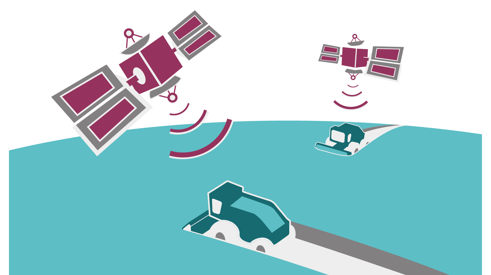
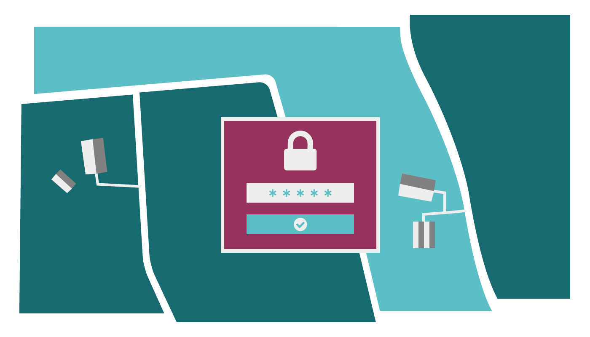
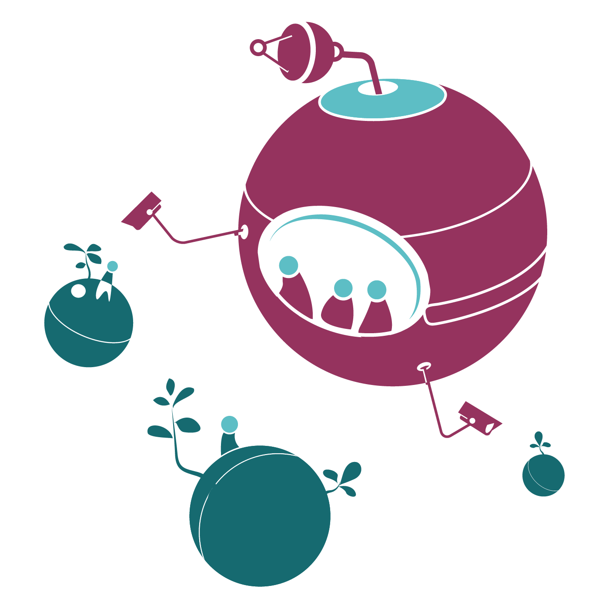
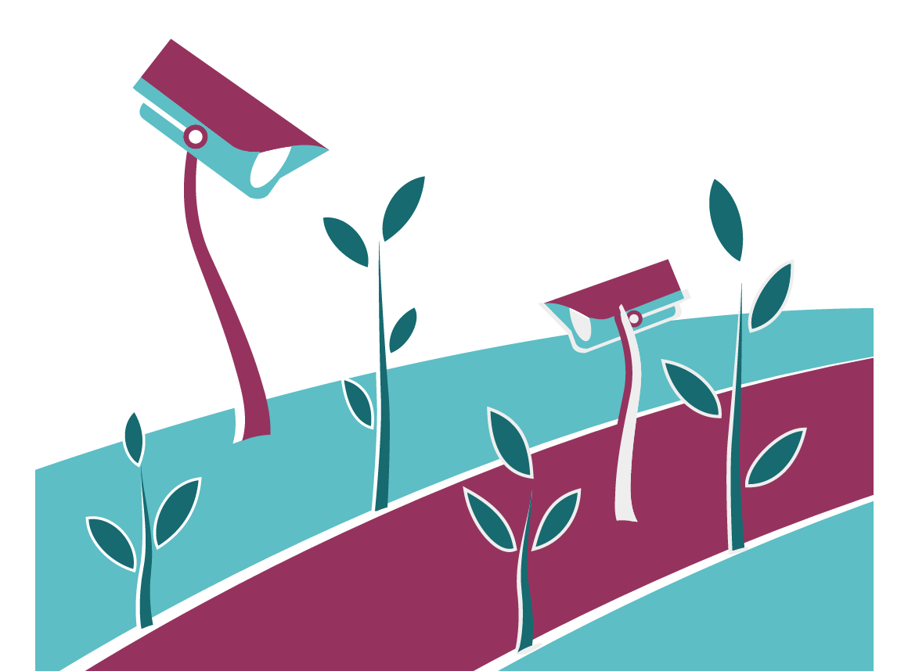
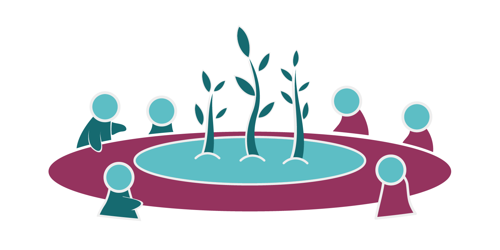

---

layout: page
title: Responsible Data in Agriculture 
description: The agriculture sector is creating increasing amounts of data, from many different sources. The most well resourced actors are able to delve into new technologies and make the most of those insights, whereas others are unable to take such risks or divert their limited resources.  
image: /media/index/agriculture.png
funder_name: GODAN
funder_logo: /images/logos/godan.svg
funder_link: http://www.godan.info/documents/responsible-data-agriculture
published: true
navigation:
  - Introduction
  - Overview
  - Challenges
  - Tensions
  - Best Practices
  - Conclusion
  - Acknowledgements

---

# Responsible Data in Agriculture

## Introduction

The agriculture sector is creating increasing amounts of data, from many different sources. From tractors equipped with GPS tracking, to open data released by government ministries; data is becoming ever more valuable, as agricultural business development and global food policy decisions are being made based upon data. But the sector is also home to severe resource inequality. The largest agricultural companies make billions of dollars per year, in comparison with subsistence farmers growing just enough to feed themselves, or smallholder farmers who grow enough to sell on a year-by-year basis.

When it comes to data and technology, these differences in resources translate to stark power imbalances in data access and use. The most well resourced actors are able to delve into new technologies and make the most of those insights, whereas others are unable to take any such risks or divert any of their limited resources. Access to and use of data has radically changed the business models and behaviour of some of those well resourced actors, but in contrast, those with fewer resources are receiving the same, limited access to information that they always have.

This piece aims to provide a broad overview of some of the responsible data challenges facing these actors, with a focus on the power imbalance between actors, and looking into how that inequality affects behaviour when it comes to the agricultural data ecosystem. What are the concerns of those with limited resources, when it comes to this new and rapidly changing data environment? In addition, what are the ethical grey areas or uncertainties that we need to address in the future?

Consider **[precision agriculture][2]**, a farm management concept based on observing and measuring crops, environment variables and management operations with sensors and satellites. The spread of precision agriculture has been enabled by growing access to satellite imagery with various filters, sensors in machinery, and the availability of connected computers and smartphones.

Precision agriculture provides farmers with information and farm management advice to  improve their decision making and optimise their activity. At the moment, however, most precision farming applications are employed in highly capital-intensive farming systems and most of the access to technologies and data remains in the hands of a few, large-scale farmers and service providers.

Specialised companies offer access to software and data to assist with [precision agriculture][3], but only the better-resourced companies and farmers can take advantage of these new offerings.

## Overview

“Agriculture data” covers a wide range of information. Many private and public sector actors are involved within the agricultural data ecosystem, collecting, analysing and using different bits of data to inform their actions internally, and sometimes also externally with other stakeholders further down the value chain.

### Open data

Open data has become more widely used within the agricultural data environment, as the growth of the GODAN partnership illustrates. But if we refer to open data in its ‘traditional’ definition as per the [Open Definition][4] of being online, machine-readable and openly-licensed, this new availability of data online does not necessarily reach any of the smaller actors within the agricultural sector. As such, **availability** and **accessibility** mean very different things when it comes to open data in agriculture, as we explore below.

Given the global and inherently diverse nature of the sector, it can be very difficult for people reflected in published datasets to make their opinions known on the global stage about the data itself. As a result, data being published does not necessarily mean that it is data of high quality, and verifying its quality is very difficult. Uncertainty around **data quality** is a major concern, as we discuss further in the section.

If leveraged correctly, data from and about the agricultural sector has the power to increase yields, and give smallholder farmers the tools to increase growth of their [businesses][9] while protecting [natural resources][10]. In practice however, the correlation between more data and better decision-making is more complicated than it sounds. But the potential issues that could be addressed are global priorities, given the growing population and increasing demand for food, coupled with depleting natural resources. As a result, governments, businesses and international organizations have begun to recognise the potential that open data in the agricultural sector holds.

### Actors

**Public sector actors**, such as agricultural, economic and statistical agencies, collect, aggregate and share relevant data within this sector. This data may be simply collected and held, but also may be shared with other government agencies to assist in policy-making decisions or opened and disseminated widely. Some of the key datasets collected include production yields, livestock, weather, market prices and farmers registries.

**Researchers** from universities, think tanks, institutes, organisations and companies collect and analyse data on subjects from plant sciences, to animal sciences, to soil or climate and many more. Others collect data from farmers via surveys or interviews to understand local markets and farmer constraints. Institutions range from from ultra-specialised, commercially focused ones to large, international organizations working toward global issues, such as conservation and food security. Bigger agricultural companies often have dedicated Research & Development departments.

**Agribusinesses** collect, analyse and use data to inform changes to the services or products they intend to market to clients. Data may be aggregated from a variety of sources, be it in-house, from government agencies or from their clients themselves. Businesses market products, such as agricultural equipment, fertiliser and seeds, or services, such as satellite imagery and financial services.

**Farmers** produce primary source agriculture data on their own farms. It may be collected by the previously identified entities or, in large-scale enterprises, analysed in-house. Farmers may use the information produced from this data, or from outside sources, such as the public sector, service providers or research institutions, to inform their farming practices. According to our interviews, the most valuable information to growers includes data on weather, soil and land, property ownership and markets.

## Challenges

Various responsible data challenges were brought up in our interviews from different perspectives, regarding almost all aspects of the data pipeline, from collection to analysis and storage. There are undoubtedly more to uncover, but here are a few of the more prominent challenges we heard.

### Sensitive data

When considering certain vulnerable communities and contexts, it seems commonly understood within the sector that certain types of agricultural data are sensitive in and of themselves and precautions should be taken in determining whether to collect and share this data at all. On a basic level, interviewees expressed the need to anonymise or restrict access to data on human subjects and their personally identifiable information (PII).

Across several interviews, it was emphasised that great care should be taken with data on community-held land, resources and agriculture, especially when it comes to data on water resources and forest rights. While CGIAR is working to create a defensible and standardized framework of exceptions to its OADM Policy, data from the [International Water and Management Institute][16] is sometimes not opened at all as exposure of shared resources can generate conflict.

<blockquote>
	
<b>Data on forest rights</b> are considered highly sensitive. Yon Fernandez de Larrinoa of FAO explained that a balance needed to be struck in sharing this data as “forests will often be considered ‘uninhabited’ according to official data. This is often inaccurate. At the same time if there is information about the forest inhabitants and they do not have their rights guaranteed, extractive companies may come in and displace these communities. We are seeing more and more cases of extractive industries pushing forest communities out of their traditional lands and resources”

</blockquote>

Mechanisms to protect traditional seeds and recipes held by indigenous populations are very strict to prevent knowledge from falling into commercial hands that may license them and require traditional communities to pay royalties. For example: if those within the FAO don’t believe they have the mechanisms to safely store indigenous knowledge, they are forced to simply give the information back to the communities to avoid potential misuse of that information. Unfortunately, there is also no guarantee that there is secure storage within the community to avoid information being lost or destroyed. As a result, managing and archiving this sensitive data for the future can be very difficult.
Data ownership

### Data ownership

With increasing amounts of data being created about farming and by farmers, one key issue is around ownership of data. Ownership of open data is addressed in a complementary piece by GODAN, but issues around ownership of data generated through new areas of agriculture technology remain relatively unexplored.

The ownership of data becomes [“murky”][17] once it is aggregated with other farmers’ data - in many cases, this is then considered to be in the ownership of the company responsible, as outlined in more detail by Neal Rasmussen in [“From Precision Agriculture to Market Manipulation”][18]. 

### Vulnerable communities

The issues and tensions mentioned above become even more stark when it comes to particularly vulnerable communities, such as indigenous populations, migrant farmers and displaced smallholder farmers who are lacking in basic land rights; women are especially vulnerable in such circumstances.

<blockquote>
	
It is estimated that across Africa, women contribute <a href="http://www.un.org/africarenewal/magazine/april-2008/women-struggle-secure-land-rights">70% of of food production</a>. Despite this, women are often denied their land rights, meaning that they cannot legally “own” land, which can leave them in precarious situations after divorce or the death of a spouse. It also leaves women dependent upon male relatives for access to and use of land, and often the earnings that come as a result. Even when laws are amended, a lack of access to information then  means that knowledge of these changes does not trickle down to society. In Zimbabwe, for example, the government amended the inheritance law to make the surviving spouse, whether male or female, the legitimate heir. Quoted in <a href="http://www.un.org/africarenewal/magazine/april-2008/women-struggle-secure-land-rights">Africa Renewal magazine</a>, Kaori Izumi, a rural development officer at the UN’s Food and Agriculture Organization (FAO) says “lack of information means many women in rural areas are not aware of it.”

</blockquote>

Yon Fernandez de Larrinoa explained that a huge issue among indigenous communities is protecting who has access to data - with particular concern about the data getting into the hands of transnational corporations and large multinational companies. Their concerns are well founded: cases of intellectual property rights being handed to companies who produce seeds rather than to [people who use the seeds][22] are not [uncommon][23]. Effectively, once indigenous people share information, they lose control over such resources, which can have huge negative effects on their livelihoods.

On a global level, indigenous and environmental activists are increasingly threatened, as highlighted by Global Witness’ **Deadly Environment** campaign, launched in 2014.

Image captured from Global Witness’ [Deadly Environment](https://www.globalwitness.org/en/campaigns/environmental-activists/deadly-environment/) campaign, published in 2014  

This fear of sharing information sits in almost direct contrast to the push for more open data on the sector: in the case of indigenous peoples, the **sensitive information** isn’t personally identifiable information, but rather knowledge that could then be used against them by malicious actors looking to profit from that knowledge. For women with precarious land rights, data making it particularly visible that they are managing or using the land without legal rights might make it easier for external actors to gain those land rights.

## Tensions

Given the huge power disparities present within actors in the agricultural sector, it comes as no surprise that there are a number of tensions when it comes to the use, creation and analysis of data. Even within the limited group of interviewees we spoke to, there were some drastically different perspectives and views expressed. Below is a summary of just some of the main tensions we came across.

### Farm profiling

Within the realm of privacy challenges for individuals online, **user profiling** is a growing issue: effectively, the recording and classification of behaviours through aggregating and [gathering data][24]. For example, this can be seen in **consumer profiling** where automated data gathered on a consumer limits what they are offered in the future, or even affects the cost of goods or services offered to them, based on their past actions.

This act of **profiling** is happening in the agricultural sector too, with **farm profiling**. Data gathered from sensors and hi-tech farm equipment, alongside satellite imagery, census data and geospatial data, can provide a lot of information about a farm and its activities, all without the active consent of the farmer.

<blockquote>
	
<a href="http://www.farmmarketid.com/">Farm Market iD</a> is a US-based company offering marketing solutions for the agriculture sector, billing themselves as “the company that provides the most accurate data about farmers and the crops they grow.” They see good farm data as an essential asset for companies looking to sell services or products to the agriculture industry, and offer databases of particular regions in the United States as well as Geospatial Analysis to provide data on crop health, crop productivity, irrigation patterns and more. Their aim is to help marketers target farms more accurately based on their use - which implies that the data gathered on the farms is not for the farmers, but for the marketers.

</blockquote>

Effectively, data gathered from farm technologies is helping companies create profiles of farms through dedicated services, which is likely to be affecting what kinds of products farmers are being sold. Though this might improve marketing strategies of companies, it might also limit the options open to farmers, or affect prices offered to them.

### Benefit sharing

A number of the people we spoke to expressed concern at the way in which data in the agricultural sector is being exploited by well resourced actors, with one interviewee comparing the power imbalance and resulting exploitation to that of colonialism in the way that it is extracted and used, without any resulting benefit being shared with the original population. As a more specific example, Ajit Maru, a GFAR/FAO officer, mentioned “the rush today in developed country businesses on collecting weather, soil, crop and seed data from developing countries in Asia, Africa and Latin America - there are almost no indigenous businesses of the developing countries yet in this area.”

Fatma Ben Rejeb of the Pan-African Farmers Organisation (PAFO) took a pragmatic approach to this data use, saying: “with or without us, our data is going to be used. At least we could benefit from its use.” For her, being involved and having direct contact with the companies involved is the best way she sees of making this happen: farmers and their organisations would then be able to decide how to use their data and benefit from it.

Relating to open data, Justin Chisenga also mentioned the concern by most people about “opening up the data to those who can make money from it.” Given the lack of certainty around ownership, it seems reasonable to expect that if this were to happen, resulting benefits from the data would not be shared back with farmers - despite the fact that the data wouldn’t exist if it weren’t for the farmers contributing that data.

Despite the recognition of farmers’right “to participate in decision-making regarding, and in the fair and equitable sharing of the benefits arising from, the use of plant genetic resources for food and agriculture” in the [International Treaty on Plant Genetic Resources for Food and Agriculture][25], the sector is even beginning to consider that the access and sharing provisions within the treaty that implore the practice of research institutions making seeds available for free is not set up for equitable benefit sharing.

### Information asymmetry

As discussed, different actors within the sector have vastly different levels of access to information - ranging from agricultural companies, to ministries, distributors and even researchers.

Matthew McNaughton from Slashroots mentioned that many of the smaller actors he works with are “often have the least access to sources of information, such as market data, which larger institutional players receive weekly.” This relates directly not just to issues of **availability** mentioned often when it comes to open data, but also of **accessibility** (see earlier sections).

<blockquote>
	
In Jamaica, the marketing division of the Rural Agricultural Development Authority (RADA) sends out a report of prices for crops across the island to a large email database they have of farmers. But this report ends up being used most by “middleman” distributors - and isn’t getting to many farmers. So, the distributors are getting the information and using it to negotiate with the farmers from a better-informed position, which results in a clear information asymmetry. This is partly to do with the distributions channels: RADA used used to print this information in the newspaper and send out some sort of SMS service, but both of these channels became very expensive.

</blockquote>

Fatma Ben Rejeb of PAFO said that farmers within her network know that private sector companies are collecting data on everything from pesticide use to production income and weather patterns - but they have no access or very limited access to it themselves.

Ben Raskin, from the Soil Association, says that they often get requests from PhD students and research institutions in the UK and beyond, asking to speak with growers for interviews for research purposes. The farmers in question often don’t have time to speak to them, so don’t get connected to the interviewers, and it seems unclear how or whether the final product (presumably an academic paper) would be made available or useful for the farmers.

Overall, it seems clear that the people suffering most from these information gaps are those with the least resources to spare: rural farmers, smallholder farmers, or those unable to pay for access to databases or technology that would make accessing the information easier for them.

### Known unknowns

With increased use of technology, comes increased generation of data. From the perspective of smallholder farmers, it seems difficult, if not impossible, to know exactly how this data is being used and where it is going. For example, Fatma Ben Rejeb of PAFO says “it’s very difficult to be aware of what’s really happening” because of a lack of transparency around what’s really happening with farmers’ data. Not knowing where the data is going or what it is being used for makes it difficult to judge how seriously they should be taking this issue.

One interviewee mentioned concerns that farmers, local NGOs/CSOs and farmers cooperatives have no way to vet implementers of farmer-facing projects. Without vetting, there is no way to know how farmer data is being used. Unbeknownst to them, farmers may be at risk.

## Best practices

Through our interviews and desk research, there were a number of best practices suggested as ways to mitigate the responsible data challenges mentioned above. Many of these are not unique to the agriculture sector, but rather speak to broad responsible data best practices writ large.

### Education and awareness 

One of the biggest differences between people we spoke to was how they perceived the effects of publishing data. Broadly speaking, those coming from the **open data** perspective were keen to publish everything apart from personally identifiable information. Others, especially those working with smallholder farmers, or indigenous populations, were much more aware that publishing data would benefit only the better-resourced actors in the agriculture sector, and expressed serious concerns about the potential unintended consequences of publishing data about, for example, indigenous populations.  

They were keen to emphasise that much more needs to happen in addition to making data available as online open data for farmers to make use of it - including educating farmers on their rights to data and information, and strengthening their capacity to make use of information to inform their practices.

<blockquote>
	
From the <a href="http://www.gfar.net/sites/default/files/files/Rights%20of%20Farmers%20for%20Data%20Information%20and%20Knowledge.pdf">Rights of Farmers for Data, Information and Knowledge</a>:

	
<i>Increasing awareness of smallholder farmers to defend their rights to data, information and knowledge is crucial. Farmers need to enrich their knowledge and ability to identify effective information in order to adapt to the changes of social development. The role of advisory and extension services is important to provide training for smallholder farmers. Improving farmers’ understanding and use of information is also important. They need to have the knowledge and skills needed to gradually adapt to the demands of the new information society.</i> (Pages 8-9)

	
The Global Forum on Agricultural Research <a href="http://www.gfar.net/ ">(GFAR)</a> carries out several activities around data and information, including convening actors to discuss key issues on agricultural, especially research, data and information management, advocacy and promotion of “open” data. They also co-run the site <a href="http://www.gfar.net/content/agriprofiles-enabling-global-networking-agriculture">AgriProfiles</a>, a search portal giving access to profiles of experts and organizations in the field of agriculture, bridging across separately hosted directories and online communities. They try to actively consider the interests of resource-poor smallholder farmers and producers in developing countries, capacity development, improving governance of data flows and forward-thinking ICT use, data and information in agriculture.

</blockquote>

### Establishing and regularly reviewing policies

Proactive recognition of the inequalities at play when it comes to data use in the agriculture sector is a prerequisite to ensuring that new data uses are sure to mitigate, rather than strengthen, these inequalities.

Some organisations are doing this via focused **policies**, such as CGIAR’s [Open Access and Data Management Policy][28]. In the international development sector, Oxfam has developed a [Responsible Data policy][29] which looks at their internal management and use of data to ensure they are working in a responsible and ethical way. There is a lot of potential for re-use of items within these policies to reduce the burden of developing a new policy from scratch.

Given the quickly moving field and fast-changing technologies available, it is essential to regularly review these policies to ensure they are still valid. For example, as the cost of satellite imagery drops, access will undoubtedly increase and so the considerations around actors using satellite imagery will need to be re-evaluated.

<blockquote>
	
As part of CGIAR’s Open Data and Open Access Initiative, the Systems Office team supports Centers in helping them identify whether the data they are working with falls into exception categories (sensitive information, or information that can identify individuals when combined with other datasets) in order to put data management structures in place at the project planning stage. The Systems Office also works with Centers to ensure that informed consent is an important part of their project framework.

</blockquote>

### Strengthening and enabling rights of vulnerable people

Within the sector, vulnerable communities are most at risk of being put at a further disadvantage as a result of the increased use and influx of data. One way of countering this is by focusing on strengthening rights of those groups, such as farmers’ rights.

[The Privacy and Security Principles for Farm Data](http://www.fb.org/tmp/uploads/PrivacyAndSecurityPrinciplesForFarmData.pdf), a declaration signed by 37 ATPs as of March 2016, marks the beginning of integrating actionable practices into data collection and use by companies. However, unless farmers have the awareness and resources to defend their rights, there can be no accountability for principles like these. International organizations need to recognise this, and train their members on how to advocate for their rights as well as better understand the use of their [information][30].

<blockquote>
	
eGranary is an initiative from farmers in Eastern Africa to “empower themselves in both input and output markets.” Through the project, information is collated about farmers and their harvests via mobile phones, and shared back only with other member farmers in the network. This model is being replicated in other regional of Africa, and PAFO are looking at collating these regional projects to create a continental database, once the regional ones are set up.

</blockquote>

### Prioritising contextual considerations 

In many of the responsible data challenges and tensions outlined above, the importance of **context** in making appropriate and responsible decisions cannot be underestimated. Even when a certain dataset is deemed publishable in one context, the same information in another context might have very different consequences.

In many cases, choices around how best to disseminate information are being made based upon existing information systems and cultural understandings of various technologies. In some cases, radio remains the best way to communicate with farmers working in rural situations. In others, with high levels of mobile penetration, SMS or IVR is best.

In order to make these kinds of decisions in a responsible way, sharing the decision-making responsibility with people from the communities themselves seems to be the best way of ensuring no harm or negative unintended consequences. Co-design methods and collaboration early on in the data sharing process is also recommended as a way of getting solid buy-in from relevant communities.

## Conclusion

As new actors are joining the sector whose primary focus is on data management, collection or analysis, well resourced actors who can afford to pay for these services are getting a headstart on the others. Those with the fewest resources, on the margins of the sector, such as indigenous populations and smallholder farmers, are most at risk of having their needs ignored here. Without awareness of their rights, or of how their data is being used and the subsequent effects, inequalities are at risk of growing due to data-driven insights, rather than being reduced.

As a result, there is a clear need to build capacity among smallholder farmers and less well resourced actors in the sector on how to deal with the growing amounts of data that are becoming available. Simply making data available is not enough to address these differences, and more needs to be done, potentially through providing low-cost advisory services on data use, or more accessible capacity-building options which clearly outline the reasons behind such offerings.

The responsibility for addressing this does not lie solely with the smaller players in the sector, though. Practising responsible data approaches should be a key concern and policy of the larger actors, from Ministries of Agriculture to companies gathering and dealing with large amounts of data on the sector. Developing policies to proactively identify and address these issues will be an important step to making sure data-driven insights can benefit everyone in the sector.

Ultimately, a thoughtful and responsible approach to dealing with data will benefit the sector as a whole, but for this to happen, well resourced actors need to make this a priority. Speaking to people outside of the “usual suspects” present at data in agriculture events will be essential to making sure that this approach is representative of the diverse range of actors present in the sector.

There is much potential for data to affect how the agricultural sector functions, but without a proactive, responsible approach, there is a very real risk of these changes benefiting only the most powerful actors within the sector.

## Acknowledgements

Content by Lindsay Ferris and Zara Rahman for [The Engine Room](https://theengineroom.org), with research and project assistance from Tom Walker and Kara Kaminski-Killany. This work was made possible through the financial support of [GODAN](http://www.godan.info/). Illustrations by Dimitrios Stamatis and production by Tin Geber.

First published September 2016. The full report is available for download as a [PDF](http://www.godan.info/file/46934/download?token=Co5JuSLO).

[1]: https://responsibledata.io 
[2]: https://en.wikipedia.org/wiki/Precision_agriculture 
[3]: http://www.precisionag.com/technology/guidance/15-precision-agriculture-companies-to-watch-in-2016-opinion/ 
[4]: https://opendefinition.org 
[7]: http://www.cgiar.org/ 
[9]: http://scholarship.law.umn.edu/cgi/viewcontent.cgi?article=1008&context=mjlst 
[10]: http://blogs.edf.org/growingreturns/2015/02/11/a-farmers-perspective-4-reasons-why-collecting-data-is-important/ 
[11]: http://www.fao.org/home/en/ 
[12]: http://api.data.fao.org/1.0/ 
[13]: http://library.cgiar.org/ 
[14]: https://www.soilassociation.org/ 
[15]: http://www.informationisbeautiful.net/visualizations/worlds-biggest-data-breaches-hacks/
[16]: http://www.iwmi.cgiar.org/ 
[17]: http://scholarship.law.umn.edu/cgi/viewcontent.cgi?article=1008&context=mjlst 
[18]: http://scholarship.law.umn.edu/cgi/viewcontent.cgi?article=1008&context=mjlst 
[22]: https://wiki.p2pfoundation.net/Data_Cooperatives
[23]: http://www.scidev.net/global/bioprospecting/news/farmers-rights-at-stake-in-chile-s-monsanto-law-bill.html 
[24]: https://epic.org/privacy/profiling/ 
[25]: http://www.planttreaty.org/content/article-xiv 
[28]: http://www.icarda.org/sites/default/files/CGIAR%20OA%20Policy%20-%20October%202%202013%20-%20Approved%20by%20Consortium%20Board.pdf 
[29]: http://policy-practice.oxfam.org.uk/blog/2015/08/a-rights-based-approach-to-treating-data-responsibly 
[30]: http://www.gfar.net/sites/default/files/files/Rights%20of%20Farmers%20for%20Data%20Information%20and%20Knowledge.pdf 
